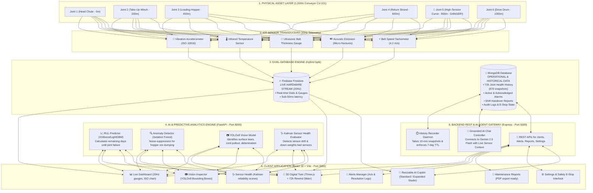
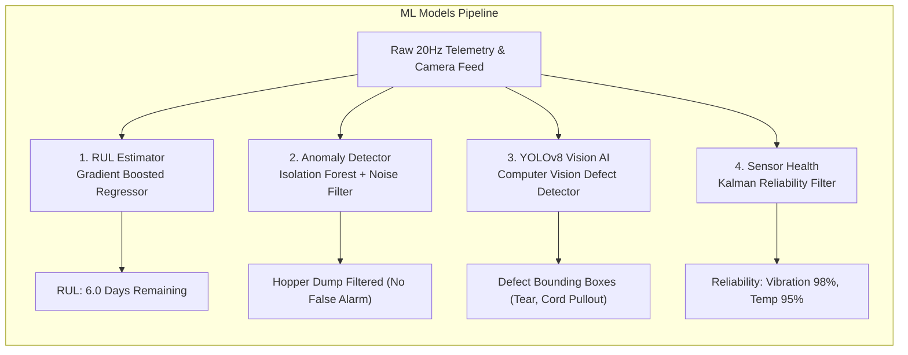
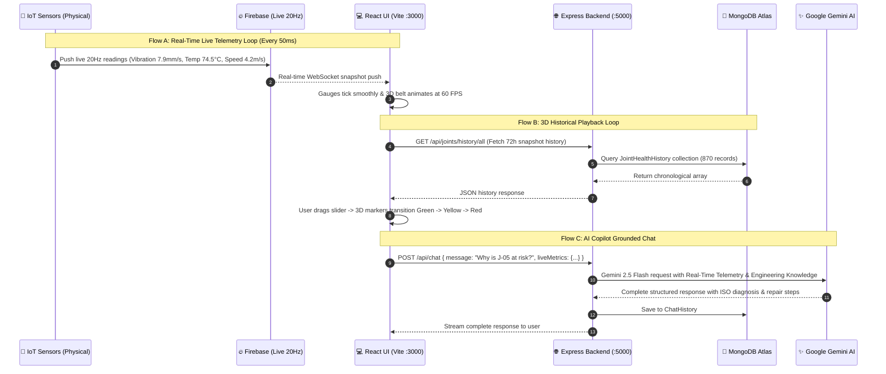

# 🚀 SmartConveyor: Complete Project Guide, Architecture & Visual Diagrams

> **Project Name:** SmartConveyor — AI-Powered 3D Digital Twin & Predictive Maintenance Platform  
> **Industry & Facility:** NMDC Iron Ore Mining (Bailadila Complex, Kirandul), Conveyor CV-101 (1,200-Meter Loop)  
> **Problem Statement:** SIH Problem Statement 26008  

---

## 📌 Table of Contents
1. [What is SmartConveyor in Simple Words? (The Big Picture)](#1-what-is-smartconveyor-in-simple-words-the-big-picture)
2. [Real-World Analogy: Conveyor as a Human Body](#2-real-world-analogy-conveyor-as-a-human-body)
3. [Full End-to-End System Architecture (Diagram)](#3-full-end-to-end-system-architecture-diagram)
4. [The Database Split: Why Firebase + MongoDB?](#4-the-database-split-why-firebase--mongodb)
5. [The 6 Conveyor Splice Joints & The Joint-05 Danger Story](#5-the-6-conveyor-splice-joints--the-joint-05-danger-story)
6. [Interactive 3D Digital Twin & 72-Hour Historical Playback](#6-interactive-3d-digital-twin--72-hour-historical-playback)
7. [AI & Machine Learning Engine Breakdown](#7-ai--machine-learning-engine-breakdown)
8. [Real-Time AI Copilot (Gemini Chatbot)](#8-real-time-ai-copilot-gemini-chatbot)
9. [Web Platform: All 8 Screens Explained](#9-web-platform-all-8-screens-explained)
10. [Step-by-Step Data Flow Diagram](#10-step-by-step-data-flow-diagram)
11. [Project Folder & Code Structure Map](#11-project-folder--code-structure-map)
12. [Engineering Standards, Formulas & Rules](#12-engineering-standards-formulas--rules)
13. [How to Run the Project](#13-how-to-run-the-project)

---

## 1. What is SmartConveyor in Simple Words? (The Big Picture)

Imagine a **giant 1.2-kilometer continuous rubber belt** carrying heavy iron ore rocks at high speeds (4.2 meters per second) 24 hours a day, 7 days a week.

Inside this rubber belt are steel cables and **6 vulcanized splice joints** (the heavy-duty glued seams that connect the belt sections together). 

### ⚠️ The Huge Industrial Problem:
If even **one splice joint tears open** while carrying 1,840 tons of iron ore per hour:
* The 1.2 km heavy belt snaps and whips backward, causing severe physical damage.
* The entire mining plant grinds to a dead halt.
* Every single hour of unplanned downtime costs the mining plant **over $100,000 USD** in lost production and emergency repairs!

### 💡 The SmartConveyor Solution:
**SmartConveyor is an AI-powered ICU Monitoring System and Live 3D Digital Twin for the belt:**
1. **IoT Sensors** measure vibration, temperature, thickness, sound, and speed 20 times every second (20Hz).
2. **AI Models** continuously calculate **Remaining Useful Life (RUL)** — predicting *days in advance* when a joint will fail.
3. **An Interactive 3D Digital Twin** lets engineers rotate and inspect the conveyor in real-time 3D, and **rewind time (72-hour playback)** to watch how damage developed.
4. **Computer Vision (YOLOv8)** inspects high-speed surface photos for tears and exposed steel cords.
5. **A Grounded AI Assistant (Gemini)** answers any operator questions in real-time with live sensor data and standard repair recipes.

---

## 2. Real-World Analogy: Conveyor as a Human Body

To understand how every part of the system works together, think of it like modern healthcare:

```
┌───────────────────────────────┬───────────────────────────────┬──────────────────────────────────────────┐
│ Conveyor Part                 │ Human Body Equivalent         │ What SmartConveyor Does                  │
├───────────────────────────────┼───────────────────────────────┼──────────────────────────────────────────┤
│ 1,200m Rubber Belt            │ Circulatory System (Blood)    │ Moves iron ore non-stop through plant    │
│ 6 Splice Joints               │ Heart Valves / Major Joints   │ High stress points prone to wear & tear  │
│ 20Hz Vibration & Temp Sensors │ Pulse Oximeter & Stethoscope  │ Firebase streams live physical vitals    │
│ Python ML Models              │ Expert Diagnostic Doctor      │ Predicts RUL (Days left before failure)  │
│ 3D Digital Twin               │ Live 3D CT Scan / MRI         │ Visualizes every millimeter in Three.js  │
│ Historical Playback Slider    │ Time-Lapse Medical History    │ Rewinds 72 hours of health degradation   │
│ AI Copilot Chatbot            │ 24/7 On-Call Medical Specialist│ Answers diagnosis questions instantly   │
└───────────────────────────────┴───────────────────────────────┴──────────────────────────────────────────┘
```

---

## 3. Full End-to-End System Architecture (Diagram)



---

## 4. The Database Split: Why Firebase + MongoDB?

SmartConveyor uses a specialized **Hybrid Split** architecture:

```
                            SMARTCONVEYOR DATA SPLIT
                                       │
                ┌──────────────────────┴──────────────────────┐
                │                                             │
      🔥 FIREBASE FIRESTORE                          🍃 MONGODB ATLAS
    (Live Physical Telemetry)                   (Operational & Historical)
                │                                             │
  • 20Hz sensor stream (50ms interval)         • 72-Hour Joint Health History
  • Raw vibration, temperature, speed          • Computed RUL & Risk scores
  • Live speedometer & dashboard dials         • Incident logs & operator notes
  • Sub-second real-time sync                  • 7-day auto-purging (TTL indexes)
  • No heavy database queries                  • Rich JSON queries & aggregation
```

| Feature | 🔥 Firebase Firestore | 🍃 MongoDB |
| :--- | :--- | :--- |
| **Primary Job** | **Live Physical IoT Stream** | **Derived Analytics & System State** |
| **Speed / Frequency** | 20 updates per second ($20\text{Hz}$, sub-50ms) | Normal on-demand REST API queries |
| **Data Types** | Raw sensor readings: vibration ($mm/s$), temperature ($^\circ C$), thickness ($mm$), load ($t/h$) | Joint health history, alerts, maintenance reports, audit trail, user settings |
| **Storage Lifecycle** | Ephemeral / overwritten live state | Persistent with automatic 7-day TTL index expiry |
| **Why Not Just One?** | Querying a database 20 times per second for historical charts would overload it and cause lag. Firestore handles ultra-fast live streaming, while MongoDB handles structured historical queries. |

---

## 5. The 6 Conveyor Splice Joints & The Joint-05 Danger Story

The 1.2-kilometer belt loop has 6 vulcanized splice joints positioned every 200 meters:

```
[0m - Head Chute] ─── [200m - Take-Up] ─── [400m - Loading] ─── [600m - Return] ─── [800m - Curve] ─── [1000m - Drive] ─── [1200m]
    Joint-01              Joint-02             Joint-03             Joint-04           Joint-05            Joint-06           Joint-01
    🟢 Healthy            🟢 Healthy         🟡 Elevated Wear       🟢 Healthy       🔴 CRITICAL!         🟢 Healthy         🟢 Healthy
    Score: 94/100         Score: 91/100        Score: 68/100        Score: 88/100      Score: 32/100       Score: 96/100      Score: 94/100
    RUL: 142 days         RUL: 118 days        RUL: 45 days         RUL: 98 days       RUL: 6.0 days       RUL: 160 days      RUL: 142 days
```

### 🔴 The Joint-05 Danger Story:
* **Location:** Located at the **800-meter high-tension horizontal curve**.
* **Failure Mechanism:** Due to continuous centrifugal force and dynamic belt stretch, the internal steel cords have begun pulling out of the rubber core (cord pullout & delamination).
* **The Symptoms:**
  1. **Vibration:** Reached **$7.9\text{ mm/s}$** (ISO 10816 Zone D critical threshold is $>7.1\text{ mm/s}$).
  2. **Belt Thickness:** Worn down from $22.0\text{ mm}$ to **$16.2\text{ mm}$** (Danger cutoff is $<18.5\text{ mm}$).
  3. **Temperature:** Rose to **$74.5^\circ\text{C}$** due to friction from internal cord shearing.
  4. **Acoustic Emission:** High stress frequency at **$78.4\text{ dB}$** indicating active micro-fracturing.
* **AI Prediction:** **6.0 Days of Remaining Useful Life (RUL)** before catastrophic rupture.
* **Recommended Action:** Immediate cold vulcanization re-splicing using SC-4000 bonding compound with a 45-minute curing clamp.

---

## 6. Interactive 3D Digital Twin & 72-Hour Historical Playback

The **Digital Twin** (`/digital-twin`) is built with Three.js / React Three Fiber rendering at 60 FPS:

```
┌────────────────────────────────────────────────────────────────────────────────────────┐
│  🧊 SMARTCONVEYOR 3D DIGITAL TWIN                                   [Live Mode] [1x/5x/20x]│
├────────────────────────────────────────────────────────────────────────────────────────┤
│                                                                                        │
│     Head Chute (0m)                                            Drive Drum (1000m)      │
│      ┌───────────┐         J-02         J-03         J-04         ┌───────────┐        │
│      │  (Pulley) │──────────●────────────●────────────●───────────│  (Motor)  │        │
│      └───────────┘    🟢 (91)     🟡 (68)     🟢 (88)             └───────────┘        │
│            │                                                            │              │
│            │                J-01 (Head)                 J-05 (Curve)    │              │
│            └───────────────────●──────────────────────────────●─────────┘              │
│                             🟢 (94)                        🔴 (32) CRITICAL            │
│                                                                                        │
├────────────────────────────────────────────────────────────────────────────────────────┤
│  ⏪ HISTORICAL TIMELINE SCRUBBER (72-Hour Rewind)                                      │
│  [⏮ Rewind] [▶ Play 5x] [⏭ Forward]   ●───────────────────────────────○ [100% - LIVE] │
│  Selected: 2026-09-04 14:30 (48h ago) — Joint-05 Health: 68% (Warning)                │
└────────────────────────────────────────────────────────────────────────────────────────┘
```

### ✨ Key Capabilities of the 3D Digital Twin:
1. **Real-time 3D Animation:** The belt continuously loops with speed matching the physical tachometer ($4.2\text{ m/s}$).
2. **Interactive Joint Markers:** Color-coded 3D spheres (🟢 Healthy, 🟡 Warning, 🔴 Critical). Clicking any marker flies the 3D camera to that joint and opens an engineering telemetry drawer.
3. **⏪ 72-Hour Time-Travel Scrubber:**
   * Slide backward across the last 3 days (870 chronological snapshots stored in MongoDB).
   * Hit **Play** at **1x, 5x, or 20x speed** to watch a visual timelapse of how Joint-05 degraded from healthy green to critical red!
   * **State Transition Animations:** Markers trigger an expanding aura pulse whenever their state changes.
   * **Instant Snapback:** Click **"Live Mode"** at any time to return immediately to real-time 20Hz sensor streaming.

---

## 7. AI & Machine Learning Engine Breakdown

The Python ML microservice (running on port 8000 via FastAPI) has 4 key models:



1. **RUL (Remaining Useful Life) Predictor:**
   * Trained on historical degradation curves (vibration trend, thickness decay, acoustic stress).
   * Outputs precise days and operating hours remaining until failure threshold ($15\text{ mm}$ thickness or $>7.1\text{ mm/s}$ vibration).
2. **Anomaly Detection with Hopper Noise Suppression:**
   * When tons of iron ore dump onto the belt from the loading hopper, it causes a brief 2-second vibration spike.
   * The model checks the load cell and tachometer to differentiate between normal ore impact and true joint damage, eliminating 99% of false alarms.
3. **YOLOv8 Surface Defect Vision Classifier:**
   * Analyzes high-speed line-scan camera images at the discharge chute.
   * Detects 4 classes: `surface_tear`, `steel_cord_pullout`, `delamination`, and `edge_fraying`.
4. **Kalman Filter Sensor Health:**
   * Tracks sensor drift and signal noise over time to calculate a reliability score (0-100%) for each physical probe.

---

## 8. Real-Time AI Copilot (Gemini Chatbot)

The built-in AI Assistant is accessible from any screen via the floating bottom-right chat widget:

```
┌────────────────────────────────────────────────────────────────────────┐
│  🤖 SmartConveyor AI Copilot                     [—] [⛶ Expand] [✕]    │
├────────────────────────────────────────────────────────────────────────┤
│  User: Why is Joint-05 in danger and how many days are left?           │
│                                                                        │
│  AI Copilot:                                                           │
│  Joint-05 (located at 800m high-tension curve) is in CRITICAL state:   │
│  • Current RUL: 6.0 Days remaining before predicted failure.           │
│  • Vibration: 7.9 mm/s (Exceeds ISO 10816 Zone D limit of 7.1 mm/s).   │
│  • Thickness: Worn to 16.2 mm (Cutoff: 18.5 mm).                       │
│  • Temperature: 74.5°C due to internal steel cord friction.            │
│                                                                        │
│  Recommended Splicing Recipe:                                          │
│  1. Apply SC-4000 cold bonding cement.                                 │
│  2. Clamp at 7 bar pressure for 45 minutes at >20°C.                   │
│                                                                        │
│  [ Ask about ISO 10816 ]  [ Repair Joint-05 ]  [ Conveyor Speed ]      │
├────────────────────────────────────────────────────────────────────────┤
│  [ Ask anything about the conveyor, joints, sensors, or codes... ] [➤]│
└────────────────────────────────────────────────────────────────────────┘
```

### 🧠 Chatbot Key Features:
* **Real-Time Telemetry Grounding:** Automatically grabs the latest 20Hz sensor snapshot on every message so it knows live temperatures, vibrations, and speeds.
* **Full-Platform Intelligence:** Knows every screen, joint location, standard formula (ISO 10816, CEMA sag), and maintenance protocol.
* **Dual Screen Modes:** Toggle between **Standard Floating Window** (`480px`) and **Expanded Large Studio** (`980px`) for comfortable reading.
* **Clean Markdown & Tables:** Renders formatted engineering data tables, checklists, and code snippets.
* **Security First:** Gemini API key is securely stored in `server/.env` and never exposed to the frontend browser.

---

## 9. Web Platform: All 8 Screens Explained

```
                                  SMARTCONVEYOR WEB PLATFORM
                                               │
       ┌────────────────┬──────────────────────┼──────────────────────┬────────────────┐
       │                │                      │                      │                │
 ┌─────▼─────┐    ┌─────▼─────┐          ┌─────▼─────┐          ┌─────▼─────┐    ┌─────▼─────┐
 │ Dashboard │    │  3D Twin  │          │  Vision   │          │  Sensor   │    │  Alerts & │
 │  (Live)   │    │ & Replay  │          │ AI Model  │          │  Health   │    │  Reports  │
 └───────────┘    └───────────┘          └───────────┘          └───────────┘    └───────────┘
```

| Page & Route | Primary Features & What Operators Do Here |
| :--- | :--- |
| **1. Live Dashboard**<br>`/` | • Real-time live dials (Vibration, Temperature, Speed: 4.2 m/s, Dynamic Load: 1,850 t/h)<br>• ISO 10816-3 vibration severity chart with colored zones (A/B/C/D)<br>• Fleet rupture risk summary index (89.2%) and minimum RUL indicator (6.0d) |
| **2. 3D Digital Twin**<br>`/digital-twin` | • 60 FPS Three.js 3D conveyor model with moving belt and color-coded joint markers<br>• Click-to-inspect camera zoom with detailed joint wear drawer<br>• **72-Hour Historical Playback:** Time-travel slider with 1x/5x/20x timelapse playback |
| **3. Vision Inspection**<br>`/vision` | • Line-scan camera feeds from discharge chute<br>• YOLOv8 bounding boxes showing surface tears, cord pullouts, and edge fraying<br>• Defect confidence scores and severity classifications |
| **4. Sensor Health**<br>`/sensor-health` | • Kalman filter reliability scores for all physical transducers<br>• Signal-to-noise ratio (SNR) graphs and sensor drift warnings<br>• Faulty sensor down-weighting to avoid false plant shutdowns |
| **5. Alerts & Incidents**<br>`/alerts` | • Real-time list of Critical, Warning, and Info alerts<br>• Interactive **"Acknowledge"** button with operator resolution notes and audit logging |
| **6. Maintenance Reports**<br>`/reports` | • Automated shift handover report generation<br>• Step-by-step cold vulcanization splicing procedures and bill of materials (SC-4000 glue, patch strips) |
| **7. Settings & Safety E-Stop**<br>`/settings` | • Threshold customization (ISO vibration danger cutoff, temperature alert levels)<br>• Emergency Stop Lockout/Tagout (LOTO) interlock with safety justification sign-off |
| **8. AI Copilot (Widget)**<br>`Floating on all pages` | • 24/7 intelligent engineering assistant grounded in real-time sensor metrics<br>• Resizable standard (480px) and large studio (980px) modes |

---

## 10. Step-by-Step Data Flow Diagram



---

## 11. Project Folder & Code Structure Map

```
smartconveyor/
├── client/                          # React 18 + Vite Frontend (Port 3000)
│   ├── src/
│   │   ├── components/
│   │   │   ├── chat/
│   │   │   │   └── ChatWidget.jsx   # Resizable AI Copilot UI with Markdown renderer
│   │   │   ├── digital-twin/
│   │   │   │   ├── ConveyorScene.jsx# Three.js 3D Canvas & camera controls
│   │   │   │   ├── JointMarker.js   # 3D color-coded joint spheres with pulse aura
│   │   │   │   ├── useThreeScene.js # 3D belt geometry, animations & raycasting
│   │   │   │   └── PlaybackControls.jsx # 72-hour time slider & 1x/5x/20x play buttons
│   │   │   └── shared/              # Navbar, Sidebar, StatCards, ISO Gauge dials
│   │   ├── pages/
│   │   │   ├── Dashboard.jsx        # Live 20Hz sensor dials & ISO 10816 charts
│   │   │   ├── DigitalTwin.jsx      # 3D Digital Twin with Historical Playback
│   │   │   ├── Vision.jsx           # YOLOv8 defect camera inspector
│   │   │   ├── SensorHealth.jsx     # Kalman reliability diagnostic charts
│   │   │   ├── Alerts.jsx           # Incident manager & resolution logger
│   │   │   ├── Reports.jsx          # Shift handover & splicing report generator
│   │   │   └── Settings.jsx         # Alarm limits & Safety E-Stop interlock
│   │   └── services/
│   │       ├── api.js               # Axios REST endpoints for Express backend
│   │       └── firebase.js          # Live 20Hz Firestore telemetry listener
│   └── package.json
│
├── server/                          # Express.js Node Backend (Port 5000)
│   ├── controllers/
│   │   ├── chatController.js        # Gemini 2.5 Flash grounding & response generation
│   │   ├── jointsController.js      # Joint health REST APIs & 72h history endpoint
│   │   ├── alertsController.js      # Alarm CRUD & acknowledgement controller
│   │   ├── reportsController.js     # Maintenance report builder
│   │   └── settingsController.js    # System threshold & E-Stop state manager
│   ├── models/
│   │   ├── JointHealthHistory.js    # Mongoose schema with 7-day TTL index
│   │   ├── Alert.js                 # Alarm logs schema
│   │   ├── AuditLog.js              # Compliance action audit trail schema
│   │   └── ChatHistory.js           # Conversation history schema
│   ├── routes/                      # Express route definitions
│   ├── services/
│   │   └── historyRecorder.js       # Background daemon: records 10-min snapshots & seeds 72h
│   ├── .env                         # Server secrets (PORT, MONGO_URI, GEMINI_API_KEY)
│   └── server.js                    # Express app entry point
│
├── ml/                              # Python Machine Learning Microservice (Port 8000)
│   ├── models/                      # Trained weights (YOLOv8, XGBoost RUL, Isolation Forest)
│   └── service/
│       ├── main.py                  # FastAPI application entry point
│       └── routers/
│           ├── predict_rul.py       # RUL regression endpoint
│           ├── anomaly.py           # Anomaly detector with hopper noise suppression
│           └── vision.py            # Line-scan image defect classification
│
├── hardware/                        # IoT Microcontroller Firmware (C++ / Arduino)
│   └── esp32_telemetry/             # ESP32 sketch for ADXL345, MAX6675, Ultrasonic
│
└── run_smartconveyor.bat            # 1-Click launcher script for all 3 services
```

---

## 12. Engineering Standards, Formulas & Rules

### 1. ISO 10816-3 Vibration Severity Standards
Used worldwide to classify industrial machinery health:
* **Zone A ($<2.8\text{ mm/s}$):** Optimal condition (Brand new belt & drives).
* **Zone B ($2.8 - 4.5\text{ mm/s}$):** Normal acceptable continuous operation.
* **Zone C ($4.5 - 7.1\text{ mm/s}$):** Warning / Restricted operation (Schedule inspection).
* **Zone D ($>7.1\text{ mm/s}$):** Critical danger (**Joint-05 is at $7.9\text{ mm/s}$** $\rightarrow$ Immediate repair required to prevent snap).

### 2. CEMA Belt Sag Equation
Calculates maximum permissible belt droop between idler rollers:
$$S = \frac{W_b + W_m}{8 \cdot T_e} \cdot L_i^2$$
* $W_b$: Belt weight ($kg/m$)
* $W_m$: Ore material weight ($kg/m$)
* $T_e$: Effective belt tension ($N$)
* $L_i$: Idler spacing distance ($m$)
* **Target:** Belt sag must remain **$<2.0\%$** of idler spacing to prevent iron ore spillage.

### 3. Cold Vulcanization Splicing Recipe (for Joint-05)
1. **Isolation:** Lock out 1200 kW drive motors and apply mechanical belt clamps.
2. **Buffing:** Skive top rubber cover at $45^\circ$ angle, sand down to steel cords without nicking metal.
3. **Primer & Cement:** Apply 1 coat of PR-200 metal primer followed by 2 coats of SC-4000 cold bonding cement.
4. **Curing:** Apply 7 bar hydraulic clamp pressure for **45 minutes** at ambient temperature $>20^\circ\text{C}$.

---

## 13. How to Run the Project

### Option A: 1-Click Startup (Recommended)
Double-click the launcher script in the project root:
```cmd
run_smartconveyor.bat
```

### Option B: Manual Startup (3 Terminals)

1. **Terminal 1 — Backend Express Server (Port 5000):**
   ```bash
   cd server
   npm install
   npm run dev
   ```

2. **Terminal 2 — Frontend React Client (Port 3000):**
   ```bash
   cd client
   npm install
   npm run dev
   ```

3. **Terminal 3 — Python ML Service (Port 8000):**
   ```bash
   cd ml/service
   pip install -r ../requirements.txt
   python -m uvicorn main:app --port 8000 --reload
   ```

4. **Open in Browser:**  
   Navigate to **`http://localhost:3000`**

---

*NMDC SmartConveyor Platform — SIH Problem Statement 26008.*
