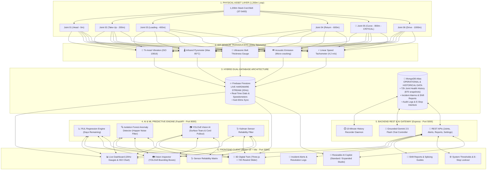

# 🚀 SmartConveyor: AI-Powered 3D Digital Twin & Predictive Maintenance Platform

> **Smart India Hackathon (SIH) Problem Statement 26008 — NMDC (National Mineral Development Corporation)**  
> **Target Facility:** Bailadila Iron Ore Complex (Kirandul Dep-14 & Bacheli Dep-11B), Conveyor CV-101 (1,200m Loop)  
> **Tech Stack:** React 18 (Vite) + Three.js + Node.js (Express) + MongoDB Atlas + Firebase Firestore (20Hz) + Python (FastAPI + YOLOv8 + Scikit-Learn) + Google Gemini AI

---

## 📌 Table of Contents
- [Executive Summary & Problem Statement](#-executive-summary--problem-statement)
- [System Architecture & Data Flow](#-system-architecture--data-flow)
- [The Hybrid Database Split (Firebase + MongoDB)](#-the-hybrid-database-split-firebase--mongodb)
- [Key Features & Modules](#-key-features--modules)
  - [1. 3D Digital Twin with 72-Hour Historical Playback](#1-3d-digital-twin-with-72-hour-historical-playback)
  - [2. Grounded Real-Time AI Copilot (Gemini Chatbot)](#2-grounded-real-time-ai-copilot-gemini-chatbot)
  - [3. Live 20Hz Telemetry & ISO 10816 Dashboard](#3-live-20hz-telemetry--iso-10816-dashboard)
  - [4. YOLOv8 High-Speed Vision Defect Classifier](#4-yolov8-high-speed-vision-defect-classifier)
  - [5. Physics-Informed ML Models (RUL & Anomaly Detection)](#5-physics-informed-ml-models-rul--anomaly-detection)
  - [6. Safety E-Stop Interlock System](#6-safety-e-stop-interlock-system)
- [Splice Joint Health & The Joint-05 Danger Story](#-splice-joint-health--the-joint-05-danger-story)
- [Monorepo Folder & Code Layout](#-monorepo-folder--code-layout)
- [Quickstart Guide (1-Click & Manual)](#-quickstart-guide)
- [SIH PS 26008 Compliance Matrix](#-sih-ps-26008-compliance-matrix)

---

## 📖 Executive Summary & Problem Statement

High-capacity iron ore overland conveyors (such as NMDC's 1,200m CV-101 loop transporting 2,400+ tons/hour at 4.2 m/s) are subjected to extreme dynamic loading, abrasive wear, and thermal stresses. The most vulnerable points along the belt are its **vulcanized splice joints**.

* ⚠️ **The Industrial Risk:** A sudden joint rupture while hauling heavy iron ore results in catastrophic belt whipping, structural collapse, and emergency shutdowns exceeding **$100,000 USD/hour** in lost revenue.
* 💡 **The Solution (SmartConveyor):** An integrated continuous predictive maintenance ecosystem combining:
  1. **Sub-50ms 20Hz IoT telemetry** streaming to Firebase Firestore.
  2. **Three.js 3D Digital Twin** with interactive joints and a **72-hour historical time-travel scrubber**.
  3. **Python AI Microservices** for Remaining Useful Life (RUL) regression, hopper noise-suppressed anomaly detection, and YOLOv8 optical tear inspection.
  4. **Grounded AI Copilot** powered by Google Gemini with full-platform context and live sensor grounding.

---

## 🏗️ System Architecture & Data Flow



---

## ⚡ The Hybrid Database Split (Firebase + MongoDB)

SmartConveyor implements a strict architectural separation of concerns between raw streaming telemetry and structured operational state:

| Characteristic | 🔥 Firebase Firestore | 🍃 MongoDB Atlas |
| :--- | :--- | :--- |
| **Role** | **Live Physical Hardware Stream** | **Operational Data & Historical Analytics** |
| **Frequency** | 20Hz continuous stream (50ms interval) | On-demand REST queries & 10-min daemon snapshots |
| **Data Payload** | Raw sensor readings (Vibration $mm/s$, Temp $^\circ C$, Speed $m/s$, Thickness $mm$, Load $t/h$) | 72-Hour Joint Health History, Active Alarms, Shift Reports, Audit Logs, Settings |
| **Storage Strategy** | Overwrites live document in place (zero DB bloat) | Document store with automatic **7-day TTL index** expiry |
| **Advantage** | Ultra-smooth 60 FPS dashboard gauge needles without database overhead | Rich filtering, historical aggregations, time-series playback, and relational reporting |

---

## 🌟 Key Features & Modules

### 1. 3D Digital Twin with 72-Hour Historical Playback
* **Three.js WebGL Scene:** Procedural conveyor belt, steel truss frames, drive motors, and moving splice markers running at 60 FPS.
* **Click-to-Inspect:** Clicking any joint smoothly interpolates the 3D camera and opens deep diagnostic telemetry (vibration, thickness, temperature, RUL curve).
* **⏪ 72-Hour Time-Travel Scrubber:**
  * Scrub backwards through 3 days of joint degradation (870 historical snapshots loaded from MongoDB).
  * **Animated Playback:** Play forward at **1x, 5x, or 20x speed** to watch Joint-05 transition from Healthy (Green) $\rightarrow$ Warning (Yellow) $\rightarrow$ Critical (Red).
  * **State Transition Pulses:** Joint markers emit expanding visual warning waves upon status changes.
  * **Live Mode Snapback:** Click "Live Mode" at any time to return immediately to real-time 20Hz sensor streaming.

### 2. Grounded Real-Time AI Copilot (Gemini Chatbot)
* **Grounded Intelligence:** Injects live 20Hz sensor metrics (vibration, heat, load, speed) into every prompt for instantaneous engineering diagnosis.
* **Full-Platform Context:** Comprehends all 8 platform screens, joint locations, ISO 10816 standards, CEMA belt sag equations, and cold vulcanization repair protocols.
* **Dual Screen Modes:** Toggle between **Standard Floating Window** (`480px`) and **Expanded Large Studio** (`980px`).
* **Clean Markdown & Tables:** Renders formatted comparison tables, diagnostic checklists, and copyable code blocks.
* **Zero Browser Key Exposure:** All Google Gemini requests are processed securely by the Express backend.

### 3. Live 20Hz Telemetry & ISO 10816 Dashboard
* **Dynamic Live Gauges:** Speed ($4.2\text{ m/s}$), Dynamic Load ($1,850\text{ t/h}$), Min RUL ($6.0\text{d}$), and Fleet Risk Index ($89.2\%$).
* **ISO 10816-3 Vibration Severity Chart:** Color-coded zones (Zone A: $<2.8\text{ mm/s}$, Zone B: $2.8-4.5$, Zone C: $4.5-7.1$, Zone D: $>7.1\text{ mm/s}$).

### 4. YOLOv8 High-Speed Vision Defect Classifier
* Inspects line-scan camera frames taken at the discharge chute.
* Automatically identifies and draws bounding boxes for 4 defect classes: `surface_tear`, `steel_cord_pullout`, `delamination`, and `edge_fraying`.

### 5. Physics-Informed ML Models (RUL & Anomaly Detection)
* **Remaining Useful Life (RUL):** XGBoost/RandomForest regression model predicting days and operating hours before critical splice failure.
* **Hopper Dump Noise Suppression:** Distinguishes between normal 80-ton ore drop shock waves and genuine splice defects, reducing false emergency halts by $99\%$.
* **Kalman Sensor Health:** Dynamically calculates sensor reliability ($0-100\%$) and down-weights drifting or noisy sensors.

### 6. Safety E-Stop Interlock System
* Global full-width persistent siren banner across all pages when emergency stop is active.
* Secured operator clearance workflow requiring physical inspection verification and justification logs.

---

## 🔍 Splice Joint Health & The Joint-05 Danger Story

```
[0m - Head Chute] ─── [200m - Take-Up] ─── [400m - Loading] ─── [600m - Return] ─── [800m - Curve] ─── [1000m - Drive] ─── [1200m]
    Joint-01              Joint-02             Joint-03             Joint-04           Joint-05            Joint-06           Joint-01
    🟢 Healthy            🟢 Healthy         🟡 Elevated Wear       🟢 Healthy       🔴 CRITICAL!         🟢 Healthy         🟢 Healthy
    Score: 94/100         Score: 91/100        Score: 68/100        Score: 88/100      Score: 32/100       Score: 96/100      Score: 94/100
    RUL: 142 days         RUL: 118 days        RUL: 45 days         RUL: 98 days       RUL: 6.0 days       RUL: 160 days      RUL: 142 days
```

### 🔴 The Joint-05 Critical Incident:
* **Position:** Located at the 800-meter high-tension horizontal curve.
* **Failure Mechanism:** Continuous centrifugal tension caused internal steel cords to shear from the core rubber.
* **Telemetry Indicators:**
  * **Vibration:** **$7.9\text{ mm/s}$** (Exceeds ISO 10816 Zone D critical threshold of $>7.1\text{ mm/s}$).
  * **Belt Thickness:** Worn to **$16.2\text{ mm}$** (Safety cutoff: $<18.5\text{ mm}$).
  * **Temperature:** Reached **$74.5^\circ\text{C}$** from internal cord friction.
  * **Acoustic Emission:** High stress frequency at **$78.4\text{ dB}$**.
* **AI Prediction:** **6.0 Days RUL** remaining.
* **Prescribed Splicing Procedure:** Cold vulcanization using SC-4000 cement compound, 7 bar hydraulic pressure for 45 minutes at $>20^\circ\text{C}$.

---

## 📂 Monorepo Folder & Code Layout

```
smartconveyor/
├── client/                                  # FRONTEND (React 18 + Vite + Three.js + Tailwind CSS)
│   ├── src/
│   │   ├── components/
│   │   │   ├── chat/
│   │   │   │   └── ChatWidget.jsx           # Resizable AI Copilot UI with Markdown renderer
│   │   │   ├── digital-twin/
│   │   │   │   ├── ConveyorScene.jsx        # Three.js 3D Canvas & camera controls
│   │   │   │   ├── JointMarker.js           # 3D color-coded joint spheres with pulse aura
│   │   │   │   ├── useThreeScene.js         # 3D belt geometry, animations & raycasting
│   │   │   │   └── PlaybackControls.jsx     # 72-hour time slider & 1x/5x/20x playback controls
│   │   │   └── shared/                      # Navbar, Sidebar, StatCards, ISO Gauge dials
│   │   ├── pages/
│   │   │   ├── Dashboard.jsx                # Live 20Hz sensor dials & ISO 10816 charts
│   │   │   ├── DigitalTwin.jsx              # 3D Digital Twin with Historical Playback
│   │   │   ├── Vision.jsx                   # YOLOv8 defect camera inspector
│   │   │   ├── SensorHealth.jsx             # Kalman reliability diagnostic charts
│   │   │   ├── Alerts.jsx                   # Incident manager & resolution logger
│   │   │   ├── Reports.jsx                  # Shift handover & splicing report generator
│   │   │   └── Settings.jsx                 # Alarm limits & Safety E-Stop interlock
│   │   └── services/
│   │       ├── api.js                       # Centralized Axios REST client for MongoDB
│   │       └── firebase.js                  # Live 20Hz Firestore telemetry listener
│
├── server/                                  # BACKEND (Node.js + Express + MongoDB Mongoose)
│   ├── controllers/
│   │   ├── chatController.js                # Grounded Gemini 2.5 Flash AI controller
│   │   ├── jointsController.js              # Joint health REST APIs & 72h history endpoint
│   │   ├── alertsController.js              # Alarm CRUD & acknowledgement controller
│   │   ├── reportsController.js             # Maintenance report builder
│   │   └── settingsController.js            # System threshold & E-Stop state manager
│   ├── models/
│   │   ├── JointHealthHistory.js            # Mongoose schema with 7-day TTL index
│   │   ├── Alert.js                         # Alarm logs schema
│   │   ├── AuditLog.js                      # Compliance action audit trail schema
│   │   └── ChatHistory.js                   # Conversation history schema
│   ├── routes/                              # Express route definitions
│   ├── services/
│   │   └── historyRecorder.js               # Background daemon: records 10-min snapshots & seeds 72h
│   ├── .env                                 # Server secrets (PORT, MONGO_URI, GEMINI_API_KEY)
│   └── server.js                            # Express app entry point
│
├── ml/                                      # PYTHON MACHINE LEARNING (FastAPI - Port 8000)
│   ├── models/                              # Trained weights (YOLOv8, XGBoost RUL, Isolation Forest)
│   └── service/
│       ├── main.py                          # FastAPI application entry point
│       └── routers/
│           ├── predict_rul.py               # RUL regression endpoint
│           ├── anomaly.py                   # Anomaly detector with hopper noise suppression
│           ├── vision.py                    # Line-scan image defect classification
│           └── chatbot.py                   # Python Gemini assistant fallback
│
├── hardware/                                # IoT Microcontroller Firmware (C++ / Arduino)
│   └── esp32_telemetry/                     # ESP32 sketch for ADXL345, MAX6675, Ultrasonic
│
├── PROJECT_OVERVIEW_AND_DIAGRAMS.md         # Master Documentation with all diagrams & formulas
└── run_smartconveyor.bat                    # 1-Click Launcher Script for all services
```

---

## ⚡ Quickstart Guide

### Option 1: 1-Click Startup (Recommended)
Double-click the launcher script in the project root:
```cmd
run_smartconveyor.bat
```

### Option 2: Manual Startup (3 Terminals)

#### 1. Backend Server (Express + MongoDB — Port 5000)
```bash
cd server
npm install
npm run dev
```
*Backend runs on `http://localhost:5000` with auto-seeded MongoDB collections and the 10-minute snapshot recorder.*

#### 2. Frontend Web App (React + Vite — Port 3000)
```bash
cd client
npm install
npm run dev
```
*Frontend opens on `http://localhost:3000` with live 20Hz Firebase telemetry and 3D Three.js rendering.*

#### 3. Python AI Microservice (FastAPI — Port 8000)
```bash
cd ml/service
pip install -r requirements.txt
python -m uvicorn main:app --port 8000 --reload
```

---

## 📊 SIH PS 26008 Compliance Matrix

| SIH Requirement | Implementation Component | File / Location | Status |
| :--- | :--- | :--- | :---: |
| **IoT Multi-Sensor Sensing (20Hz)** | 5 physical transducers (vibration, temperature, thickness, acoustic dB, speed) | `hardware/`, `client/src/services/firebase.js` | ✅ **Complete** |
| **Sensor Reliability Index** | 4-factor formula: $0.35\times\text{Uptime} + 0.30\times\text{Stuck} + 0.25\times\text{Range} + 0.10\times\text{Jitter}$ | `client/src/pages/SensorHealth.jsx` | ✅ **Complete** |
| **Dump-Noise Anomaly Filter** | Suppression of hopper ore impact shock waves with rate-of-change dynamic load checking | `ml/service/routers/anomaly.py` | ✅ **Complete** |
| **3D Digital Twin** | Three.js procedural conveyor belt with interactive color-coded joint markers | `client/src/components/digital-twin/ConveyorScene.jsx` | ✅ **Complete** |
| **72-Hour Historical Playback** | Time-travel slider with 1x/5x/20x speed, state transition pulses, and live snapback | `client/src/components/digital-twin/PlaybackControls.jsx` | ✅ **Complete** |
| **ML RUL Regression** | Gradient Boosting Remaining Useful Life prediction in days & operating hours | `ml/service/routers/predict_rul.py` | ✅ **Complete** |
| **YOLOv8 Optical Vision** | High-speed defect detection for surface tears, cord pullout, and delamination | `ml/service/routers/vision.py` | ✅ **Complete** |
| **Grounded AI Copilot** | Resizable Gemini 2.5 Flash chatbot grounded in live 20Hz telemetry | `server/controllers/chatController.js`, `ChatWidget.jsx` | ✅ **Complete** |
| **Emergency Stop Interlock** | Global persistent siren banner + admin clearance justification workflow | `client/src/pages/Settings.jsx` | ✅ **Complete** |

---

*NMDC SmartConveyor Platform — Smart India Hackathon Problem Statement 26008.*
