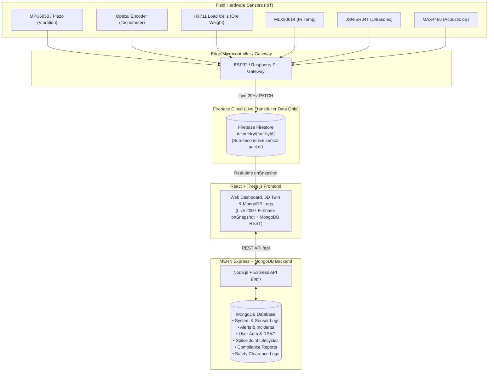

# SmartConveyor Hardware-to-Cloud Integration Guide
> **SIH Problem Statement 26008 (NMDC Iron Ore Mining)**  
> **Architecture: Physical Sensors $\to$ ESP32 / Raspberry Pi Edge $\to$ Firebase Live Telemetry $\to$ React Frontend $\longleftrightarrow$ Express + MongoDB Backend**

---

## 1. End-to-End System Pipeline



---

## 2. Hardware Pinout Wiring Table (ESP32)

| Sensor Description | Industrial Sensor Model | Interface | ESP32 GPIO Pin |
| :--- | :--- | :--- | :--- |
| **Drive Pulley Vibration** | MPU6050 / SW-420 Piezo | Analog ADC / I2C | `GPIO34` / `SDA: 21, SCL: 22` |
| **Belt Speed Tachometer** | LM393 Optical Interrupter / Hall | Digital Pulse Interrupt | `GPIO18` (IRAM Interrupt) |
| **Dynamic Ore Load** | HX711 + 4x 500kg Load Cells | 2-Wire Serial | `DT: GPIO4`, `SCK: GPIO5` |
| **Joint Core Temperature** | MLX90614 Contactless IR | I2C | `SDA: GPIO21`, `SCL: GPIO22` |
| **Ultrasonic Splice Thickness** | JSN-SR04T Waterproof Transducer | Digital Pulse (Time of Flight) | `Trig: GPIO23`, `Echo: GPIO22` |
| **Acoustic Stress Emission** | MAX4466 Electret / Piezo | Analog ADC | `GPIO35` |
| **Status LED Indicator** | Onboard LED | Digital Output | `GPIO2` |

---

## 3. Firestore Document Path & Schema

The hardware node writes directly to the following Firestore document:

**Path**: `telemetry/nmdc-kirandul-cv101`

```json
{
  "facilityId": "nmdc-kirandul-cv101",
  "timestamp": "2026-09-01T15:30:00.000Z",
  "sensors": {
    "drive_vibration": 2.35,
    "belt_speed": 4.18,
    "dynamic_load": 1860.5,
    "joint_temperature": 44.2,
    "ultrasonic_thickness": 24.6,
    "acoustic_emission": 38.2
  },
  "activeJointId": "Joint-01",
  "beltDisplacementMeters": 142.5,
  "isDumping": false
}
```

---

## 4. How to Flash and Run

### Option A: Using ESP32 (Arduino IDE)
1. Open [`hardware/esp32/smartconveyor_esp32_firmware.ino`](file:///C:/Users/Krish/.gemini/antigravity/scratch/smartconveyor/hardware/esp32/smartconveyor_esp32_firmware.ino) in Arduino IDE.
2. In Arduino IDE Library Manager, install **`ArduinoJson`** and **`WiFi`**.
3. Set your WiFi credentials and Firebase API Key:
   ```cpp
   const char* WIFI_SSID = "YourWiFi";
   const char* WIFI_PASSWORD = "YourPassword";
   const char* FIREBASE_PROJECT_ID = "smartconveyor-nmdc";
   const char* FIREBASE_API_KEY = "AIzaSy...";
   ```
4. Select board **ESP32 Dev Module** and upload.
5. Open Serial Monitor at **115200 baud**. The ESP32 will stream physical sensor readings to Firestore every 2 seconds.

---

### Option B: Using Raspberry Pi / Python Edge Gateway
1. Navigate to the Raspberry Pi gateway directory:
   ```bash
   cd hardware/raspberry_pi
   pip install requests
   ```
2. Set your Firebase project credentials in environment variables or edit `edge_gateway.py`.
3. Run the gateway:
   ```bash
   python edge_gateway.py
   ```
4. The Raspberry Pi will read the hardware interfaces and publish live telemetry to Firebase Firestore.

---

## 5. How the Web App Displays Live Hardware Data

In the React frontend:
- [`client/src/firebase/firestore.js`](file:///C:/Users/Krish/.gemini/antigravity/scratch/smartconveyor/client/src/firebase/firestore.js) attaches a real-time `onSnapshot` listener to `telemetry/nmdc-kirandul-cv101`.
- When your ESP32 or Raspberry Pi writes a new sensor packet to Firestore, Firebase automatically pushes the update to the browser within $\approx 50\text{ms}$.
- The **Dashboard Gauges**, **Live Sparkline Cards**, **Recharts Telemetry Stream**, and **3D Digital Twin** immediately react and display the real-world physical values!
